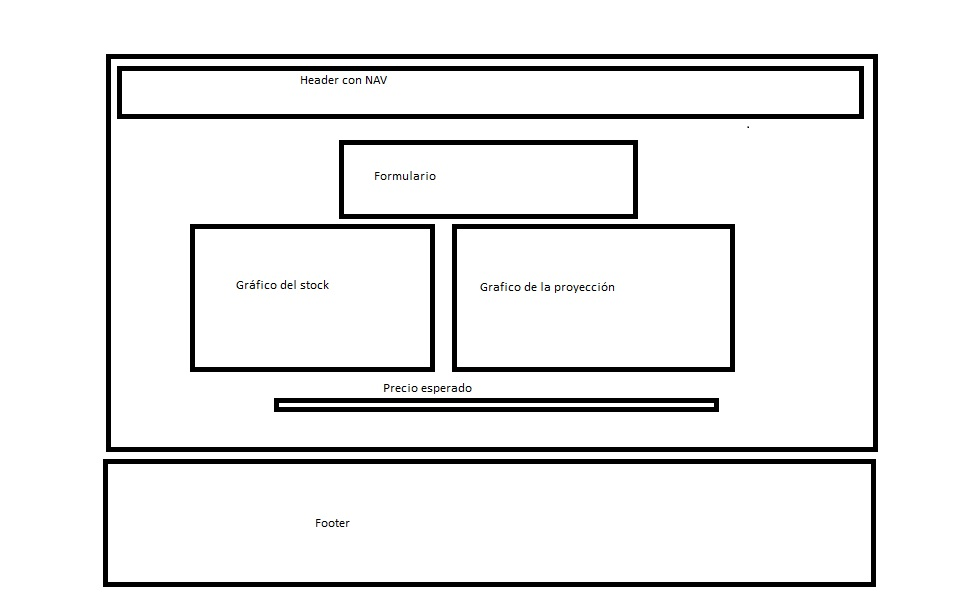

# Dashboard Proyecto 3

El siguiente proyecto se enmarca en el Bootcamp FullStack 2022 de la UDD.

## Dashboard

El siguiente Dashboard realiza una consulta a la API [Alpha Vantage](https://www.alphavantage.co/) para obtener precios de activos como acciones, divisas, entre otras, y graficarlos con la API [APEX Charts](https://apexcharts.com/).

Finalmente, y de forma adicional, se efectúa una serie de tiempo autoregresiva en base a la selección, buscando realizar un pronóstico (el algoritmo se ejecuta mediante la API [TensorFlow JS](https://www.tensorflow.org/)). 

## Funcionamiento y limitantes

Se ingresa el Activo a analizar en el formulario de la parte superior, en la sección "Acción" mediante su símbolo (Algunos ejemplos pueden ser AAPL, IBM, MSFT, BTCUSD, USDCLP, entre otros). Para las frecuencias mensuales y diarias, solamente se tiene la frecuencia definida por la API. Para los precios Intraday, se pueden definir frecuencias de 15, 30 y 60 minutos para mostrar.

Cabe destacar que, por un tema de la gratuidad de la API [Alpha Vantage](https://www.alphavantage.co/), existe un número limitado de 5 consultas por minuto.

## Layout básico

El Layout desarrollado tiene el siguiente esquema:

 

El funcionamiento responsivo busca que los elementos de la página sean dispuestos en una columna.

## Repositorio en GITHub del proyecto

[Link al proyecto](https://github.com/guitarAlgorithman/proyecto_3_dashboard)

## Página del proyecto publicada

[Link](https://guitaralgorithman.github.io/proyecto_3_dashboard/)

## Participantes

- [Gustavo Henriquez](https://github.com/guitarAlgorithman)
- [Nicolás Meneses](https://github.com/BootNM)
- [Mario Sanhueza](https://github.com/MarioASG)
